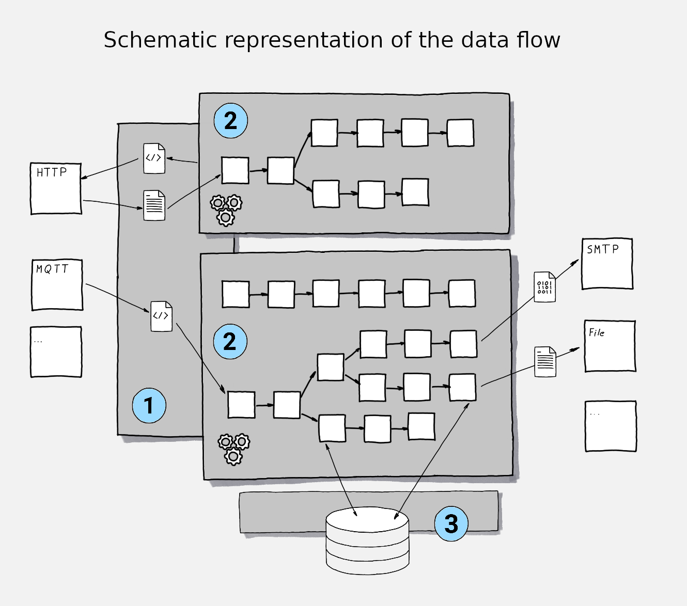

# Level2

- [Level2](#level2)
  - [What it is](#what-it-is)
  - [Preface](#preface)
    - [The main building blocks in a nutshell](#the-main-building-blocks-in-a-nutshell)
      - [Runtime](#runtime)
      - [Business Objects](#business-objects)
      - [Business Logic](#business-logic)
  - [Technical Implementation](#technical-implementation)
    - [Application Building Blocks](#application-building-blocks)
    - [Schematic overview of dataflow](#schematic-overview-of-dataflow)
    - [Scalability and parallel processing](#scalability-and-parallel-processing)
  - [How to use](#how-to-use)
    - [HTTP server for static web content](#http-server-for-static-web-content)
    - [Middleware for messages distribution in EDI](#middleware-for-messages-distribution-in-edi)
    - [Simple example of an HTTP roundtrip](#simple-example-of-an-http-roundtrip)
  - [How to build it](#how-to-build-it)
    - [External Dependencies](#external-dependencies)
      - [GoogleTest](#googletest)
      - [nlohmann/json](#nlohmannjson)
      - [SQLite](#sqlite)
      - [MQTT / Mosquitto](#mqtt--mosquitto)
  - [Current bucket list](#current-bucket-list)
  - [External references](#external-references)

## What it is

Level2 is an event driven business application framework written in C++. Its main idea is to allow building of scalable and flexible event driven applications by **declarative defining the business logic**. To achieve this, it keeps **Business Objects**, **Business Logic** and **Runtime** separated from each other to allow

- the runtime to be scalable
- business objects to be defined independent of the runtime and the business logic
- the business logic to be defined as part of the configuration allowing declarative description of the logic
- deployment of business logic to be independent of the software deployment process
- to build any kind of message oriented middleware and dialog based business (web) applications on top of it.

Chapter [How to use](#how-to-use) of this document shows some examples of how to declarative describe business processes for bootstrapping and running them with Level2.

## Preface

This software is still in a very early state. This means, that it is not production ready yet and not all features, that are described in the current documentation or that are required for production readiness, are already (fully) implemented and available. In particular, being a framework, this project requires real life use cases as proof of concept, which are also not implemented yet.

Even though, there might still be numerous gaps to be filled, Level2 already is capable of processing any kind of structured (text based) data using configurable and modularized workflows. Hence, the development has reached a point, where it makes sense to start spending further development effort with real business requirements in mind. This is mainly the case, because the core concept and core functionalities are already in place and working.

So, if you are looking for a small, performant, scalable open source framework to base your business applications on, Level2 might be worth a look for you. In case you are interested in participating and/or contributing, both would be very welcome and appreciated. But of course I am also happy if you simply use the project for your own purposes.

### The main building blocks in a nutshell

#### Runtime

The runtime implements the input-processing-output (IPO) pattern. While doing so,it provides

- Interfaces to external systems in the form of listeners (for receiving of incoming data), connectors (for sending data to external systems)
- Capability to choose between parallel and strict fifo processing of business logic
- Synchronous and asynchronous processing
- Scalability from having very small footprint in the hosting system to high performance and high data throughput on more capable systems

#### Business Objects

Business objects can either be represented in form of structured text data such as common EDI formats, XML, Json and so on or as instances of binary data objects, that might have been serialized from databases or external incoming data of any kind.

When reaching the system, incoming data is being enriched with meta information, that describes its state and (ideally) its type. By receiving this enrichment, it becomes the payload for a transaction, that will be carried out by a certain type of business logic.

#### Business Logic

The smallest building blocks of business logic inside the framework are business worker modules (or workers). These modules themselves implement the IPO pattern. They are based on a simple API, which allows modular extensibility of the system's capabilities in a way, that is independent of development and release cycle of the framework itself.

Worker modules can be chained together into pipelines. This is, where the state (respectively the meta information) of a payload and its business object comes into play. Each pipeline can have a set to matching patterns attached. These patterns are matched against the state of any incoming payload. Once a pipeline's matching patters match a payload, this particular payload will be processed by the corresponding pipeline. During the processing of a payload, a pipeline or more precise the contained worker modules can apply any kind of changes to the payload and its state information. This can either cause the payload to be processed by subsequent matching pipelines or being handed over to external systems.

## Technical Implementation

### Application Building Blocks

- The class **ApplicationContext** allows to bootstrap an entire application from a JSON file, that declares the components of the application. Further on, `ApplicationContext` covers thread safe access to environmental information about the application and its main configuration

- **Process Pipelining** allows declarative definition of processing pipelines. Such pipelines consist of a series of business logic specific worker modules, that can be chained together. As pipelines are defined declarative, they can be changed and extended at runtime, making it quick and easy to react to changing business requirements.
  
- **Connectors** to external systems using local filesystem, MQTT and HTTP (coming soon).Any further protocol is possible and can be implemented as business logic module even outside of the framework.

- Event **listeners**  to listen for events/data coming in via local filesystem, MQTT and HTTP. Any further protocol is possible but currently must be implemented as part of the framework.

- **API** for developing worker modules and connectors. Processing pipelines can be extended by making use of a **lean API**, that allows quick implementation of new  modules. For further details refer to the [Pipeline Implementation Part of the Framework](./framework/src/pipeline/README.md) or directly to [`pipelineapi.h`](./framework/src/pipeline/api/pipelineapi.h)

- Formatted and filtered **Logging** to any destination. Currently implemented are logging destinations for `stdout`, `stderr`, `file` and `syslog`. See [here](./framework/src/logger/README.md) for details.

- Generic **SQL Database Interface** to enable processing pipelines to communicate with any RDBMS. Currently SQLite is implemented as the first one. See [here](./framework/src/dbinterface/README.md) how to use the existing implementation and to extend for the support of further RDBMSs.

### Schematic overview of dataflow



As soon as an event, that is triggered by a message being received by one of the listeners, appears, it is being handed over to the `PipelineProcessor` **(1)**. This process of handing over the event/message can either be done for synchronous or asynchronous processing.

The figure above shows an example for synchronous processing of an HTTP request. In this example it is the issuer of the (HTTP) request, that instantly receives back the result of the processing. No connector needs to be involved in this case, because the HttpListener returns the processed data directly back to the http client.

Synchronous processing is possible and makes sense for protocols which allow the sender of a message to wait and instantly receive the processed data back. Hence, synchronous processing is likely to be the default for HTTP where for instance REST request need to be processed or any kind of static or dynamic web content shall be delivered to the client. However, it is still possible to use asynchronous processing for HTTP as well.

In the figure above MQTT is the protocol of choice for triggering asynchronous processing. In asynchronous mode, the Listener (in this case the MqttListener) simply hands over its message to the `PipelineProcessor` by placing it into a FIFO queue. The listener itself than does not need to take further care about the message and can confirm successful retrieval of the message if the corresponding protocol allows and/or requires that.

In both cases, be it synchronous or asynchronous processing, it is the `PipelineProcessor` who finds a suitable (business)process **(2)** for processing the incoming payload. Each of these processes can contain an arbitrary number of pipelines. Each of the contained pipelines are having  a specific set of parameters called 'matching patterns' attached, which allow the `PipelineProcessor` to match the incoming message and its meta information against. Once a message matches one particular pipeline, the `PipelineProcessor` hands over the message to that pipeline and triggers the processing. This processing continues until no further matching pipeline can be found.

Throughout the entire pipeline, any worker can access further internal or external data sources. Two of the pipelines in the above figure are making use of the SQL database interface **(3)** to read and or write data to an SQL database.

### Scalability and parallel processing

Listeners are using instances of class `PipelineFifo` for handing messages over to a `PipelineProcessor` for _asynchronous_ processing. For _synchronous_ processing in turn, it is an instance of `PipelineProcessor` itself, that messages are being handed over directly. Because listeners can make use of any number of `PipelineProcessor`s and `PipelineFifo`s, it is completely up to the application how many instances of these classes it will use.

Each `PipelineProcessor` can run one pipeline at a time. Hence one way to scale the application is to multiply the amount of `PipelineProcessor` instances.

Each `PipelineProcessor` on the other hand can deal with any number of `PipelineFifo`s while `PipelineFifo`s can also be shared across multiple instances of `PipelineProcessor`s.

On the receiving side, the Listeners can deal with any number of `PipelineProcessor`s and `PipelineFifo`s as well. Especially during _asynchronous_ processing with multiple `PipelineProcessor`s, the workload will automatically be distributed across multiple CPUs because the `PipelineProcessor`s are using a separate thread for execution of the pipelines. In _synchronous_ processing mode, it is up to the listener to use a dedicated thread for each synchronous call to `PipelineProcessor::execute`. [`HttpListener`](./framework/src/listeners/httplistener/) is the first (and currently the only synchronous) listener to implement this pattern. For `HttpListener` it appears to be reasonable to provide one instance of `PipelineProcessor` per allowed client connection.

## How to use

Declarative application design with Level2 requires the following:

1. Declaration of the pipelines, that embrace the required worker modules and execute them in order, once a corresponding message/event hits the application
2. Declaration of (business) processes, that embrace the required pipelines, that are needed to implement and execute the business logic
3. Declaration of the application building blocks such as required listeners, used (business) processes and the general configuration of the application
4. The worker modules, that are supposed to be used by the pipelines

While the first three points can be done declarative, the 4th one requires implementation of worker modules using the API, that is defined in [`pipelineapi.h`](./framework/src/pipeline/api/pipelineapi.h). The assumption is, that by the time, the pool of already implemented worker modules will grow towards an extend, that covers most of the requirements of a certain business case. Once a set of (so to say) most important worker modules exists, setting up a new application mainly will boil down to declaring the first three building blocks without the need to implement (a lot) more worker modules. Depending on the business case and the amount of already existing worker modules, it is then possible to _implement new_ business logic and maybe even more important to _change existing_ business logic just by deploying new declarations of pipelines (**1**) and business processes (**2**) to an existing application.

In the following, I will give two examples of how to do the declarative part of the application design. Both examples assume, that all requires worker modules are already available and in place. Examples for the implementation of worker modules can already be found under [framework/src/pipeline/api/workerModules/](./framework/src/pipeline/api/workerModules/) and will be subject of a chapter of the document, that is later to come.

### HTTP server for static web content

The purpose of this server shall be to listen for incoming HTTP GET request on static resources, that are stored on that server. Such resources - if found - shall be returned in a synchronous HTTP roundtrip with the response.

The following is required to wire up this functionality:

1. appropriate worker modules
   1. **GetRequestInspector** - to extract the name of the requested resource from the request and add it as parameter to the [`PipelineProcessingData`](./framework/src/pipeline/api/pipelineprocessingdata.h).
   2. **FileCollector** - to collect the requested resource from the server's local filesystem and add it as payload ([`ProcessingPayload`](./framework/src/pipeline/api/processingpayload.h)) to the `PipelineProcessingData`.
2. pipeline
   1. This simple example only requires one pipeline, that chains together and parameterizes **GetRequestInspector** and **FileCollector**
3. One process is required, that contains just the above pipeline and sets a matching pattern for that pipeline, that configures it to be triggers for incoming HTTP GET request for resources of a particular path.
4. Configure the `ApplicationContext` to set up one HttpListener on a specific port and bind it to the process of **3** for synchronous processing.

Once the worker modules `GetRequestInspector` and `FileCollector` are in place, the pipeline can be declared like

```json
{
    "pipelineName" : "processHttpGetRequests",
    "pipelineSteps" : [
        {
            "stepName":"gather requested resource path",
            "libraryName":"GetRequestInspector",
            "namedArguments" : {
                "readResourceFrom":"http.rcv.headerField.path",
                "writeResourcePathTo":"GetRequestInspector.requestedResource.path",
                "writeResourceNameTo":"GetRequestInspector.requestedResource.fileName",
            }
        },
        {
            "stepName":"find and return requested resource",
            "libraryName":"FileCollector",
            "namedArguments" : {
                "resourceStore":"ApplicationContext.staticContent/webRoot",
                "readResourcePathFrom":"GetRequestInspector.requestedResource.path",
                "readResourceNameFrom":"GetRequestInspector.requestedResource.fileName"
            }
        }
    ]
}
```

**Explanation:**

- `pipelineName` is the application wide unique name of the pipeline
- `pipelineSteps` list of steps to be executed by this pipeline. The steps are executed in the order in wich they appear in this array.
- `stepName` a pipeline wide unique name of a step
- `libraryName` the name of the shared object, that implements the required functionality and exposes it by using [pipelineapi.h](./framework/src/pipeline/api/pipelineapi.h). Under Linux, this name will be expanded by adding the prefix `lib` and the suffix `.so`.
- `namedArguments` list of library specific arguments to be passed to the shared object during execution of the pipeline. See [argumentsProcessor.cpp](./framework/src/pipeline/api/workerModules/argumentsProcessor/argumentsProcessor.cpp) for a usage example.

With this pipeline saved as `processHttpGetRequests.json`, it is now possible to declare the process

```json
{
    "processName" : "simpleStaticWebserver",
    "pipelines" : [
        {
            "pipelineConfigFile":"processHttpGetRequests.json",
            "matchingPatterns" : [
                {
                  "http.rcv.headerField.method": "GET",
                  "http.rcv.headerField.path": "^/static/[a-Z]*\\.(html|js|css)",
                  "receivedByListener": "HttpListener",
                  "receivedViaProtocol": "http"
                }
            ]
        }
    ]
}
```

**Explanation:**

- `procaessName` is the application wide unique name for this process
- `pipelines` array of pipelines contained in this process. A unique pipelines can be contained in any number of processes ss long as the `matchingPatterns` of each usage differ. in the example above, the pipeline `processHttpGetRequests.json` could be used by a different process for instance to process GET request for a different `http.rcv.headerField.path` matching pattern.
- `pipelineConfigFile` the file name under with the corresponding pipeline was saved
- `matchingPatterns` defines a list of key value pairs with are matched against the matching patterns of the payload (instances of `PipelineProcessingData`) at runtime. These patterns are represented by `PipelineProcessingData::matchingPatterns` respectively its ancestor class `Matchable::matchingPatterns`. A particular instance of `PipelineProcessingData` will be processes by a pipeline only if all the pipeline's matching patters can be matches against a corresponding matching pattern in the `Matchable::matchingPatterns` of the `PipelineProcessingData` in question. During processing of `PipelineProcessingData`, it is ensured by [`PipeLineProcessor`](./framework/src/pipeline/pipelineprocessor.h), that one instance of `PipelineProcessingData` can be processed by one particular pipeline only once (However, this feature is not implemented yet. See [chapter current bucket list](#current-bucket-list)). values of `matchingPatterns` _can_ be regular expressions. For more information on regular expressions and the supported grammar please refer to [cppreference.com - Regular expressions library](https://en.cppreference.com/w/cpp/regex).

Now, as the process is declared, the application bootstrapping for `ApplicationContext` can be set up. This will include

- The (business) process, that was declared above
- An instance of `HttpListener`
- The binding of the process from above to the `HttpListener` instance
- All required path definitions
- Setup of the application logging

```json
{
    "applicationDirectories": {
        "root": "$HOME/opt/testApplication",
        "pipelines": "etc/pipelines.d",
        "processes": "etc/processes.d",
        "workerModules": "lib"
    },
    "Listeners": {
        "HTTPListeners": [
            {
                "name": "httpGetListener01",
                "port": 8888,
                "maxClients" : 10
            },
            {
                "name": "httpGetListener02",
                "port": 8889,
                "maxClients" : 10
            }
        ]

    },
    "listenerToProcessBindings": [
      {
        "name": "HTTP get to be processed by process simpleStaticWebserver",
        "processName": "simpleStaticWebserver",
        "listenerName": "httpGetListener01",
        "type": "synchronous"
      },
      {
        "name": "HTTP get to be processed by process simpleStaticWebserver",
        "processName": "simpleStaticWebserver",
        "listenerName": "httpGetListener02",
        "type": "synchronous"
      }
    ],
    "logging": {
      "logLevel": "debug",
      "loggers" : [
        {
          "type": "file",
          "destination": "var/log/application.log"
        },
        {
          "type": "stdOut"
        }
      ]
    }
}
```

**Explanation:**

- `applicationDirectories` declares a set of standard directories for the application. During start of the application it will be ensured by `ApplicationContext`, that all these directories exist and are accessible. All directories are relative to `applicationDirectories/root`. It is possible to include variables like `$HOME` into the `root` path. Such variables will be replaces by the values of corresponding environment variables if possible.
- `Listeners` declares the listeners, that shall be started during application start. Besides the listener specific parameters, all listeners must have an application wide unique `name`.
- `listenerToProcessBindings` contains information about which processes loaded from `applicationDirectories/processes` are supposed to be attached to which listeners. It is possible to bind one process to multiple listeners for instance to trigger pipelines of the same process using different protocols or origins. Th example above simply make use of multiple bindings to showcase, that it works. The resulting parallel processing capability could also have been achieved by doubling `maxClients` of one single listener. While it is possible to bind one process to multiple listeners, it is also possible to bind multiple processes to one listeners.
- `logging` configures the application logging capabilities.

Now, with the application's context declared and saved to a file, the application can be brought to life with just a few lines of code.

```cpp
#include "level2.h"

using namespace level2;

int main() {
  APP_CONTEXT.loadApplicationConfig("/path/to/application/context.json");
  LOGGER.info("starting test application");
  return APP_CONTEXT.runApplication();
}
```

**Explanation:**

- `#include "level2.h"` includes all required headers, that are needed to gain access to the macros `APP_CONTEXT` for starting up the application and `LOGGER` for logging to the configured logging destinations.
- `APP_CONTEXT.loadApplicationConfig("/path/to/application/context.json");` subsequently loads the application declaration, that was created above
- `APP_CONTEXT.runApplication();` starts up all required listeners, loads processes and pipelines and starts into the application loop. The application loop ends by tearing down all loaded resources once the application received `SIGTERM`. In the case `0` is returned. A non zero value will be returned if something fails during initialization of the application.


> At this point it is important to mention, that in particular the functionality, that is described here for automatic stating the application using the `APP_CONTEXT`, is not implemented yet. The missing functionality in class `ApplicationContext` is what will be implemented next. See section [current bucket list](#current-bucket-list).


### Middleware for messages distribution in EDI

_(coming soon)_

### Simple example of an HTTP roundtrip

First real roundtrip, that makes use of HttpListener to

- trigger synchronous processing
- selecting the processing pipeline by parameters from the incoming HTTP request
- returning processed data to the issuer of the request

can be found in an integration test in [test_httplistener.cpp](./framework/tests/test_httplistener.cpp). Please refer to test function `TEST(HTTPListener, sendsDataBackOnGetRequest)` to see for more details on the source code part of the implementation as well as the configuration of the required (simple) processing pipeline.

Please find one first sample application [here](./sampleApplications/README.md). (Work in Progress ;-) )

## How to build it

After cloning the repo cd into the root of the repo and do the following:

- Build the project and execute all unit tests by executing
  
    `cmake . && make && ctest -V`

    This will automatically execute `getDependencies.sh` and download  `googletest` to `_deps/googletest/` from where `cmake`  will trigger its build.

    Further on, [CMakeLists.txt](./CMakeLists.txt) will download [nlohmann/json](https://github.com/nlohmann/json) and make it available to the project build.

### External Dependencies

#### GoogleTest

GoogleTest is heavily used for unit, component and integration tests in [framework/tests/](./framework/tests/).

It is automatically downloaded and built inside the project by `execute_process(COMMAND ./getDependencies.sh)` in [CMakeLists.txt](./CMakeLists.txt).

#### nlohmann/json

[nlohmann/json](https://github.com/nlohmann/json) is used throughout the project for serializing objects to and from json. This dependency is satisfied and made available to the whole project by use of `FetchContent_Declare(json URL https://github.com/nlohmann/json/releases/download/v3.11.3/json.tar.xz)` and `FetchContent_MakeAvailable(json)` in [CMakeCache.txt](./CMakeCache.txt)

#### SQLite

For building and using the DB interface classes in [dbinterface](./framework/src/dbinterface/) it is required to have SQLite development packages installed.

CMake makes use of `find_package(SQLite3 REQUIRED)` to make SQLite available for the build.

#### MQTT / Mosquitto

To build with support for MQTT, it is required to have [Eclipse Mosquitto](https://mosquitto.org/) and its development packages installed. [CMakeLists.txt](./framework/CMakeLists.txt) uses `find_package(Mosquito REQUIRED)` to make it available for the build process. However, Level2 can still be built without this dependency. MQTT support will be excluded from the build if Mosquitto can not be found.

For successful execution of MQTT related unit tests in [test_mqttconnector.cpp](./framework/tests/test_mqttconnector.cpp) and [test_mqttlistener.cpp](./framework/tests/test_mqttlistener.cpp) it is required to have an MQTT broker listening on port 1883 on the loopback interface.

## Current bucket list

- Implement `level2.h` and all missing functionality in class `ApplicationContext` for automatically bootstrapping the application and running the application loop.
- Documentation, documentation, documentation
- Implement the two use cases, that are described in chapter [How to use](#how-to-use)
- Implement execution only once feature for `PipelineProcessingData` in `PipelineProcessor`
- Authentication API and module for the HTTP server (HttpListener)
- Request filtering API and module for the HTTP server (HttpListener)
- **HTTP client** / HttpConnector.
- Finish implementation of asynchronous processing in HttpListener
- Blueprinting a setup to run HttpListener behind a reverse proxy
- Proof of concept for passing [db connections represented by instances of class `Database`](./framework/src/dbinterface/dbinterface.h) from one processing module to another through the processing pipeline.
- Implement pipeline processing loop in the `PipelineProcessor` to allow chained execution of multiple matching pipelines
- Thread safe database connection pooling
- Enable listeners to handle multiple instances of `PipelineProcessor` and `PipelineFifo` to allow more flexibility in designing multi threated processing for synchronous and asynchronous processing
- **Monitoring** capabilities should be extended beyond whats already possible by dumping the `PipelineProcessingData` and friends to Json. At least at the end of each pipeline, it could make sense to automatically persist the corresponding payload object. How the json serialization works can be seen for instance in [test_httplistener.cpp](./framework/tests/test_httplistener.cpp) in `TEST(HTTPListener, sendsDataBackOnGetRequest)`.
- Make dependency to SQLite optional
- Listener and connector for apache kafka
- Listener and connector for RabbitMQ

## External references

- [cppreference.com - Regular expressions library](https://en.cppreference.com/w/cpp/regex)
